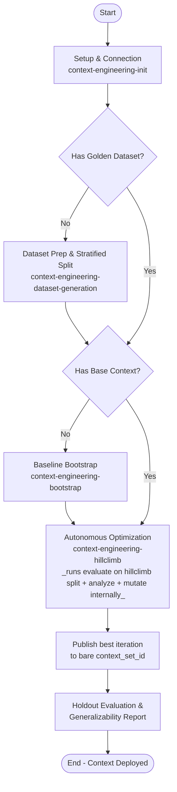

# Skill: Context Engineering Lifecycle

This skill defines the shared vocabulary, lifecycle, and safety rules used by the `context-engineering-*` peer skills. Consult it to orient before invoking a peer, or when a rule reads as "cross-cutting."

---

## Shared Terminology

A **ContextSet** is the structured knowledge blob the Gemini Data Analytics API consumes when translating a natural-language question to SQL. It contains three item types:

*   **Template** — a full NLQ → SQL mapping, generalized with placeholders (e.g., `$1`, `$2`). Teaches end-to-end query patterns.
*   **Facet** — a reusable SQL fragment (e.g., a `WHERE` predicate or a specialized join), tied to specific vocabulary. Composed into generated queries dynamically.
*   **Value Search** — a query that maps user-supplied terms (with typos, casing differences, or synonyms) to their exact database values. Resolves the value-linking problem.

See [context-engineering-generation-guide](../context-engineering-generation-guide/SKILL.md) for the JSON schemas and dialect-specific authoring standards.

---

## The Optimization Lifecycle & Phase Flow

To build high-performing data applications, context engineers typically follow a systematic, iterative optimization lifecycle (Hill-Climbing). 



---

## Where to Start

If you're new, invoke the peer that matches your current state:

*   No `.context-engineering/tools.yaml`, or no `state.md` for the experiment at `.context-engineering/experiments/<experiment_name>/` → [context-engineering-init](../context-engineering-init/SKILL.md)
*   No golden dataset → [context-engineering-dataset-generation](../context-engineering-dataset-generation/SKILL.md)
*   No base ContextSet → [context-engineering-bootstrap](../context-engineering-bootstrap/SKILL.md)
*   Have a base ContextSet and want autonomous improvement → [context-engineering-hillclimb](../context-engineering-hillclimb/SKILL.md)
*   Have a ContextSet and just want to score it → [context-engineering-evaluate](../context-engineering-evaluate/SKILL.md)

Experienced users can skip this section and invoke any peer directly.

---

## Context Store (OneMCP) Protocol

All peer skills that touch the Context Store (`bootstrap`, `evaluate`, `hillclimb`, and the `init` preflight) follow these rules. They are stated once here; peers reference them and repeat only the poll gate inline at each call site.

### Tools

| Tool | Purpose | Returns |
| :--- | :--- | :--- |
| `list_context_set_locations(project_id)` | Discover which locations accept context sets. | List of location IDs. |
| `upload_context_set(context_set, local_file_path \| context_payload, description?)` | Create **or overwrite** a context set from a local file or inline JSON. | A long-running operation (`name`). |
| `get_context_set(context_set)` | Read a context set. | `{"payload": "<ContextSet JSON string>"}`. |
| `delete_context_set(context_set)` | Delete a context set. | A long-running operation (`name`). |
| `get_operation(operation_name)` (or `project_id` + `location` + `operation_id`) | Poll a long-running operation. | `{"done": bool, ...}` plus `error` on failure. |

### Resource naming

A context set is addressed as `projects/<project_id>/locations/<location>/contextSets/<context_set_id>`.

*   `<context_set_id>` is user-chosen. `context-engineering-init` asks for it once (default: the experiment name) and records it in `state.md`; peers read it from there.
*   Hill-climbing works on a **single** transient working copy named `<context_set_id>_draft`. Every iteration overwrites it; it is deleted once, after the final publish. The final deliverable is uploaded under the bare `<context_set_id>`.

### Location resolution

Location is resolved **once**, by `context-engineering-init`: it calls `list_context_set_locations(project_id)`, lets the user pick (or confirms a named location is in the list), and records the choice in the experiment `state.md`. Peers read `Location` from `state.md` and do not call `list_context_set_locations` again. Do not assume a default location.

### Long-running operations — the poll gate

`upload_context_set` and `delete_context_set` are **asynchronous**: the tool returns as soon as the request is accepted, not when the work is done. After either call:

1.  Take `name` from the response.
2.  Call `get_operation(operation_name=<name>)`.
3.  If `done` is not `true`, wait and call again. Start with a 1 s wait and double it each time (1 s, 2 s, 4 s, 8 s, …). Stop after 5 minutes total.
4.  Log every poll response so the user can see progress.
5.  **`done: true` means the operation is complete.** Continue with the next step. No additional verification call is needed.
6.  `done: true` together with an `error` field means the operation failed. Surface the error verbatim and stop.
7.  If the 5-minute ceiling is reached, surface the operation name and stop.

**Never act on a context set whose upload operation has not yet reported `done: true`.** In particular, `evaluate` must not generate Evalbench configs or launch an evaluation until the upload it depends on is done; otherwise the evaluation runs against a missing or stale context set and its score is meaningless.

### Reading a context set to disk

`get_context_set` returns the ContextSet as a JSON string in `payload`. Parse it and write it to the target path with ordinary file tooling; the tool does not write files.

### Overwrite hazard

`upload_context_set` is an upsert: uploading to a `<context_set_id>` that already exists **silently replaces its contents**, and the previous contents cannot be recovered from the store. This hazard is handled **once, in `context-engineering-init`**: it probes the bare `<context_set_id>` with `get_context_set`, and if it already exists, tells the user the exact resource name and asks for an explicit acknowledgement before recording `Overwrite acknowledged: yes` in `state.md`. The hill-climb publish reads that line and does not ask again. If a peer finds the line missing or `no`, it routes back to init instead of uploading to the bare name.

### Idempotent delete

A `delete_context_set` that fails with NOT_FOUND is treated as success. This matters when resuming an interrupted hill-climb run, where a draft may already have been removed.

---

## Workflow Phases, Rationales & Entry Prerequisites

---

### Setup & Connection Configuration
*   **Reference**: [context-engineering-init](../context-engineering-init/SKILL.md)
*   **Goal**: Configure `.context-engineering/tools.yaml` for the Toolbox MCP server, verify runtime + GCP setup (uv, evalbench, ADC, Dataplex/GDA APIs, IAM), and write the experiment `state.md` at `.context-engineering/experiments/<experiment_name>/state.md`. Its `## Metadata` records the Context Store coordinates (`Project`, `Location`, `Context set id`, `Final resource`, `Draft resource`, optional `Seed resource`), `Overwrite acknowledged`, `Auto-approve uploads`, the loop parameters (`Tuning target`, `Plateau k`, `Max iterations`), and enrichment sources; its `## Active Database` records the Toolbox source name, type and (for Spanner Graph) `Graph Ids`. Downstream peers read these values instead of re-asking.

---

### Master Loop Control & Tuning Target Gate (`Loop{Tuning Target Met?}`)
As the master orchestrator, this skill strictly governs phase transitions after every evaluation run (`Run Evaluation And Score`). This gate **supersedes** the `## Final Summary & Next Steps` ("Conclude by providing a succinct summary... suggest actionable next steps") section in `context-engineering-evaluate/SKILL.md`:

*   **Stopping Conditions** (all recorded in `.context-engineering/experiments/<experiment_name>/state.md` by init; checked in this order after every evaluation):
    *   **Tuning target** — default **100% accuracy (`0` failed queries)** on `splits/hillclimb.json`, unless the user set a custom `Tuning target` (e.g., `0.9`).
    *   **Plateau** — the last `Plateau k` iterations (default `3`) all failed to beat the best score so far.
    *   **Iteration cap** — `Max iterations` (default `10`) iterations have been evaluated.
*   **Mandatory Post-Evaluation Check (Immediate Autonomous Branching)**:
    *   Immediately upon completing any `Run Evaluation And Score` pass on `splits/hillclimb.json`, inspect the evaluation pass rate (`passed / total`) and failed query count:
        1.  **When any Stopping Condition fires** (`pass_rate >= tuning_target`, plateau, or iteration cap):
            *   **HALT Hill-Climbing Immediately**: Do **not** enter `Optimization & Hill-Climbing Phase` and do **not** suggest another refinement loop.
            *   **Publish**: upload the best-scoring iteration's local file under the bare `<context_set_id>` (poll gate), then delete `<context_set_id>_draft` (poll gate; NOT_FOUND is success). No confirmation is asked — the overwrite was acknowledged in init. Record `## Final:` in `state.md`.
            *   **Zero-Confirmation / No-Yield Rule (Strictly Enforced)**: Do **NOT** conclude or yield your turn after scoring `splits/hillclimb.json` or after publishing, and do **NOT** ask the user for permission, confirmation, or approval to proceed to the generalizability test.
            *   **Immediately Execute Generalizability Test in the Same Turn**: Without waiting for user input, immediately continue calling tools in the exact same conversational turn to execute the **Holdout Evaluation & Generalization Reporting Phase** against the published bare `<context_set_id>` (`generate_evalbench_configs` on `splits/holdout.json` $\rightarrow$ `uvx google-evalbench@1.17.0` $\rightarrow$ `evaluate_generalizability` $\rightarrow$ display the novice-friendly On-Screen Card in chat $\rightarrow$ write `final_evaluation_report.md`).
        2.  **When no Stopping Condition fires (`pass_rate < tuning_target` and `failed > 0`)**:
            *   Proceed to `Optimization & Hill-Climbing Phase` (`context-engineering-hillclimb`) to perform Gap Analysis and Context Mutation on the failed queries, then re-evaluate.
        3.  **When the user explicitly asks to stop**: finish the current iteration cleanly, append `## User Stop` to `state.md`, and **do not publish and do not run the holdout test**. A later resume offers the choice to continue or publish.

---

### Evaluation Dataset Prep & Stratified Partitioning
*   **Reference**: [context-engineering-dataset-generation](../context-engineering-dataset-generation/SKILL.md)
*   **Requires**: Setup & Connection Configuration complete.
*   **Goal**: Build a high-quality "golden" ground-truth dataset and partition it into `splits/hillclimb.json` (Hillclimbing Questions) and `splits/holdout.json` (Holdout Variations) using the `split_dataset` MCP tool, strictly enforcing that every normalized SQL template (key) in `splits/holdout.json` is included in `splits/hillclimb.json`.
*   **Mandatory Stratified Split Enforcement (`split_dataset`)**:
    *   **Always Use `split_dataset` MCP Tool**: You MUST invoke the `split_dataset` MCP tool to generate `splits/hillclimb.json` and `splits/holdout.json` (for both newly generated datasets and user-supplied datasets). You are **strictly forbidden** from manually slicing or partitioning dataset JSON files via custom Python scripts or shell commands.
    *   **Holdout-in-Hillclimb SQL Template Invariant**: Every normalized SQL template (key) in `splits/holdout.json` **MUST** be included in `splits/hillclimb.json` (`holdout_keys <= hillclimb_keys`). Single-variation SQL templates (appearing only once in the golden dataset) are placed exclusively in `splits/hillclimb.json` and never in `splits/holdout.json`.
    *   **Template-Preserving Expansion**: When expanding seed or user-supplied queries to reach the target dataset size (e.g., 150 items: 105 hillclimbing / 45 holdout), ensure sufficient variations preserve the normalized `golden_sql` template (using Paraphrasing, Distraction Injection, Linguistic Variation, or Value Substitution). If `split_dataset` fails because too many templates have only a single variation, expand existing SQL templates with template-preserving phrasing/parameter variations and re-run `split_dataset`—never bypass `split_dataset`.
*   **Dataset Proposal & Input Scenarios**:
    *   **Proposal in Chat**: Crema proposes creating a dataset with 150 questions across 30 query patterns (105 hillclimbing questions for optimization, 45 holdout variations to test generalizability, default split ratio 0.7 and minimum holdout size 45). Internal partitions are preserved in `splits/hillclimb.json` and `splits/holdout.json` without exposing a separate `split_report.md` to the user.
    *   **Scenario (a) Full Automated Flow**: User accepts proposal $\rightarrow$ generate, expand NLQ variations, run `split_dataset` to produce stratified hillclimb/holdout splits, hill-climb on hillclimb split, publish, holdout evaluation, and generalizability reporting.
    *   **Scenario (b) User-Supplied Dataset (Auto-Split)**: User provides evaluation set $\rightarrow$ Crema auto-expands question phrasings (preserving normalized SQL templates) and runs `split_dataset` into 105 hillclimbing / 45 holdout ($N_{\text{test}} \ge 45$, default split ratio 0.7, every holdout SQL template included in hillclimb); never ask the user to pre-partition.
    *   **Scenario (c) Pre-Partitioned Datasets (Fail Early)**: User attempts to supply separate `--dev-dataset` and `--test-dataset` $\rightarrow$ fail early with `[ERROR] InvalidDatasetConfiguration`.
    *   The split is **not optional**: there is no "skip holdout" path. Every golden dataset is split into `splits/hillclimb.json` and `splits/holdout.json`, and every completed hill-climb run ends with a holdout evaluation.

---

### Baseline Context Bootstrapping
*   **Reference**: [context-engineering-bootstrap](../context-engineering-bootstrap/SKILL.md)
*   **Goal**: Generate a baseline `ContextSet` (Templates, Facets, Value Searches) from database schema and optional enrichment sources.
*   **Requires**: Setup & Connection Configuration complete.

---

### Evaluation Scoring
*   **Reference**: [context-engineering-evaluate](../context-engineering-evaluate/SKILL.md)
*   **Goal**: Run Evalbench against a ContextSet + golden dataset to produce an accuracy score and per-query failure breakdown.
*   **Requires**: Setup & Connection Configuration complete; a golden dataset and a ContextSet (local file or Context Store resource name) available.

---

### Autonomous Optimization
*   **Reference**: [context-engineering-hillclimb](../context-engineering-hillclimb/SKILL.md)
*   **Goal**: Autonomously iterate evaluate → analyze → mutate → re-upload until improvements dry up, producing a high-scoring ContextSet with no per-iteration user approval.
*   **Requires**: Setup & Connection Configuration complete; a golden dataset. The base context is optional — hillclimb invokes bootstrap when none is supplied.
*   **Note**: Hillclimb runs evaluate itself every iteration; do not run Evaluation Scoring separately as a precondition.

---

### Holdout Evaluation & Generalization Reporting Phase
*   **Reference**: Self-contained phase specification below.
*   **Automatic Entry Trigger**: Triggered **immediately and automatically** the moment the hill-climb loop stops (tuning target, plateau, or iteration cap) and the best iteration has been **published** under the bare `<context_set_id>` (`## Final:` present in `state.md`). Preempts any further optimization loops. Not triggered after a `## User Stop`.
*   **Goal**: Appended immediately after publish with zero additional user-facing steps. Evaluates the **published** context set on `splits/holdout.json` strictly once in a single read-only pass, executes the two-proportion pooled z-test via `evaluate_generalizability`, displays the novice-friendly On-Screen Card in chat, and writes `final_evaluation_report.md`.
*   **Zero-Leakage Invariant**: The holdout partition (`splits/holdout.json`) is strictly isolated during the entire hill-climbing optimization loop (zero data leakage). It must never be accessed for gap analysis, candidate selection, error harvesting, or context mutation. It is evaluated strictly once at workflow conclusion.
*   **Entry Prerequisites**:
    *   [ ] **Published**: `state.md` contains `## Final: <final resource> (from vK, score <S>)` — the best iteration is live under the bare `<context_set_id>` and `_draft` has been deleted.
    *   [ ] **Holdout Precondition Met**: `.context-engineering/experiments/<experiment_name>/splits/holdout.json` exists. It always does when the dataset came through `context-engineering-dataset-generation` (the split is mandatory); if it is missing, stop and route to that skill — do not report a verdict without it.

#### Workflow & Execution Steps

1.  **Single Read-Only Holdout Evaluation (Autonomous Zero-Prompt Execution)**:
    *   **Do NOT Prompt or Ask Permission**: Reuse `experiment_name`, `toolbox_config_path` (`.context-engineering/tools.yaml`), `toolbox_source_name` (from `## Active Database` in `state.md`), and the **published** `context_set_id` (`Final resource` in `state.md`, i.e. `projects/<project_id>/locations/<location>/contextSets/<context_set_id>`) without asking the user for any parameters or confirmation.
    *   **Generate Holdout Evalbench Configs**: Immediately call the `generate_evalbench_configs` MCP tool with `output_dir=".context-engineering/experiments/<experiment_name>/holdout_eval/"`, `dataset_path=".context-engineering/experiments/<experiment_name>/splits/holdout.json"`, and the reused `context_set_id`, `toolbox_config_path`, and `toolbox_source_name`.
    *   **Run Holdout Evaluation**: Immediately execute the canonical Evalbench command:
        `uvx google-evalbench@1.17.0 --experiment_config=.context-engineering/experiments/<experiment_name>/holdout_eval/eval_configs/run_config.yaml`
    *   **Extract Scores**: Extract `test_passed` and `test_total` from `holdout_eval/eval_reports/<job_id>/summary.csv`, and retrieve `dev_passed` and `dev_total` from the published iteration's (`vK`) entry in the `state.md` Iteration Log.

2.  **Statistical Significance Testing (Two-Proportion Pooled z-Test)**:
    *   Call the `evaluate_generalizability` tool with `dev_passed`, `dev_total`, `test_passed`, `test_total`, `alpha=0.05`, and the published `context_set_id` (bare `<context_set_id>` resource name).
    *   **Statistical Formulation**:
        *   $p_{\text{dev}} = \frac{x_{\text{dev}}}{N_{\text{dev}}}$, $p_{\text{test}} = \frac{x_{\text{test}}}{N_{\text{test}}}$
        *   $p_{\text{pool}} = \frac{x_{\text{dev}} + x_{\text{test}}}{N_{\text{dev}} + N_{\text{test}}}$
        *   $SE = \sqrt{p_{\text{pool}}(1 - p_{\text{pool}})\left(\frac{1}{N_{\text{dev}}} + \frac{1}{N_{\text{test}}}\right)}$
        *   $z = \frac{p_{\text{dev}} - p_{\text{test}}}{SE}$, $p\text{-value} = 2(1 - \Phi(|z|))$
    *   **Directional Decision Logic**:
        *   **INCONCLUSIVE**: $N_{\text{test}} < 45$ (underpowered sample size, statistical power $< 25\%$).
        *   **INVESTIGATE**: $p < 0.05$ AND $p_{\text{dev}} > p_{\text{test}}$ (statistically significant drop indicating overfitting to hillclimbing wording).
        *   **PASS**: $p \ge 0.05$ with $N_{\text{test}} \ge 45$, OR $p_{\text{test}} \ge p_{\text{dev}}$ (no statistically significant drop; context generalizes reliably).

3.  **Agent On-Screen Interface (Primary Chat Output)**:
    *   **Core Principle**: The chat card is the primary user interface. Novice users should never be required to open a markdown file to understand the verdict, performance, or next steps.
    *   **Order by Decision Relevance**: Status & Verdict $\rightarrow$ Performance Overview (4-column table) $\rightarrow$ Plain-Language Summary & Diagnosis $\rightarrow$ Immediate Next Step (including the **full published `context_set_id`** resource name when ready for production).
    *   **Plain-Language Terminology**: Use "Hillclimbing Questions" and "Holdout Questions" (not ML jargon). Explain differences humanely (e.g. `Difference: -1 queries (-3.3%, within expected variance)`). Restrict formulas, z-scores, and p-values to `final_evaluation_report.md`.
    *   **On-Screen Card Templates**:

        *   **Case 1: PASS — Ready for Production**:
            ```markdown
            🎯 **Evaluation Complete: Context Set Generalizes Reliably**

            **Status**: Ready for Production

            Your context set successfully handles new ways of asking questions without performance drops.

            | Split | Accuracy | Correct Queries | Notes |
            | :---- | :---: | :---: | :---- |
            | **Hillclimbing Questions** | **90%** | **95 / 105** | **Baseline optimization accuracy** |
            | **Holdout Questions** | **87%** | **39 / 45** | **Consistent with hillclimbing (1-question variance)** |

            **Summary**:
            * **Robustness**: The model is generalizing well and not simply memorizing hillclimbing phrases. The minor difference between hillclimbing and holdout (87% vs 90%) is well within normal statistical expectations.
            * **Next Step**: The context set is already published at `<full published context_set_id>` (from iteration `vK`, local file `vK/context_set_vK.json`). Point your application at it. No further optimization iterations required.
            ```

        *   **Case 2: INCONCLUSIVE — Sample Size Too Small**:
            ```markdown
            ⚠️ **Evaluation Inconclusive: Sample Size Too Small**

            **Status**: More Data Needed

            The holdout set is too small to determine whether the context set generalizes reliably.

            | Split | Accuracy | Correct Queries | Notes |
            | :---- | :---: | :---: | :---- |
            | **Hillclimbing Questions** | **90%** | **36 / 40** | **Baseline optimization accuracy** |
            | **Holdout Questions** | **80%** | **8 / 10** | **2 failures; sample size underpowered** |

            **Summary & Recommendation**:
            * **Diagnosis**: With only 10 holdout questions, each question changes accuracy by 10%. A statistical test cannot distinguish normal variation from genuine performance drops.
            * **Recommended Action**: **Expand Evaluation Dataset**. Add questions to reach at least **150 total pairs** (>= 105 Hillclimbing / >= 45 Holdout) and restart context engineering.
            ```

        *   **Case 3: INVESTIGATE — Performance Drop on Holdout Questions**:
            ```markdown
            ❌ **Evaluation Alert: Performance Drop on Holdout Questions**

            **Status**: Needs Optimization (Gaps Identified)

            The model passed hillclimbing questions but dropped on holdout phrasings due to missing context definitions.

            | Split | Accuracy | Correct Queries | Notes |
            | :---- | :---: | :---: | :---- |
            | **Hillclimbing Questions** | **92%** | **97 / 105** | **Baseline optimization accuracy** |
            | **Holdout Questions** | **71%** | **32 / 45** | **Statistically significant drop (-21%, p = 0.001)** |

            **Summary & Recommendation**:
            * **Diagnosis**: X of Y holdout failures (Z%) occurred because of specific context gaps.
            * **Recommended Action**: Select the appropriate remediation path:
              - **Generate Business-Rule Facets**: Have Crema generate facet items capturing missing business rules, then re-run optimization and test on a fresh holdout set.
              - **Restart with Input File**: "Restart context engineering with this file as an input." Crema will index distinct enum values and synonyms (via value search) and test on a fresh holdout set.
              - **Expand Question Phrasings**: Expand the dataset with informal phrasing, acronyms, and shorthand variations, then restart context engineering.
              - **Expand Dataset**: Generate 50 more query patterns to broaden overall entity coverage.
            ```

4.  **Save Final Evaluation Report (`final_evaluation_report.md`)**:
    *   Write the comprehensive audit report to `.context-engineering/experiments/<experiment_name>/final_evaluation_report.md`.
    *   Ordered strictly by decision relevance (Verdict & Status $\rightarrow$ Recommended Action / Next Steps $\rightarrow$ Performance Overview & Failure Breakdown $\rightarrow$ Statistical Details):
        *   `TL;DR`: Verdict, Next Steps, Generalization Drop, Significance Assessment, Summary.
        *   `1. ACTIONABLE RECOMMENDATIONS`: Concrete recommended action and next steps for the user placed at the top.
        *   `2. PERFORMANCE OVERVIEW`: Table and counts for hillclimbing vs holdout, difference note, pattern coverage.
        *   `3. HOLDOUT SET FAILURE BREAKDOWN`: Query-by-query breakdown of failed holdout cases with category and root cause.
        *   `4. STATISTICAL DETAILS`: Two-proportion pooled z-test, sample sizes ($N_{\text{dev}}, x_{\text{dev}}, N_{\text{test}}, x_{\text{test}}$), pooled proportion ($\hat{p}$), standard error ($SE$), test statistic ($z$), two-tailed $p$-value, and power analysis check placed at the bottom.

5.  **Log State Tracking (`state.md`)**:
    *   Append a `## Generalizability` section to `.context-engineering/experiments/<experiment_name>/state.md` recording the holdout evaluation path (`holdout_eval/eval_reports/<job_id>/`), holdout score (`passed / total`), the verdict (`PASS`, `INVESTIGATE`, or `INCONCLUSIVE`), and the report path. See the example in `context-engineering-hillclimb/references/workspace.md`.

#### Generalizability Diagnosis & Triage

When a user provides a `final_evaluation_report.md` from a Generalizability Test, the agent must inspect the final **Verdict** and triage the failures to determine the correct re-optimization path.

##### 1. Verdict: INCONCLUSIVE
*   **Trigger:** The report indicates an INCONCLUSIVE verdict. This means the dataset is either too small or lacks the necessary variations to yield a statistically significant measure of generalizability.
*   **Action:** Route immediately to [context-engineering-dataset-generation](../context-engineering-dataset-generation/SKILL.md). Execute the expansion workflow to scale up the dataset using template-preserving strategies until it meets the required volume and variation thresholds. Once expanded, restart the context engineering lifecycle.

##### 2. Verdict: INVESTIGATE
When the verdict is INVESTIGATE, the model suffered a statistically significant generalization drop.

> [!IMPORTANT]
> **Anti-Data Leakage Rule:** You are STRICTLY FORBIDDEN from manually patching ContextSet Templates to memorize the specific `golden_sql` answers from the holdout set. You must resolve the root capability gaps, not the exact test answers, to prevent overfitting.

Read the report's actionable recommendations and route to the corresponding skill:
*   **Path A: Context & Metadata Deficiencies (Value Linking / Business Rule Gaps)**
    *   **Trigger:** Failures stem from a missing structural bridge between the user's intent and the database schema. This includes unmapped terminology, failure to link fuzzy search strings to strict database enums/IDs, or omitted table joins and filters.
    *   **Action:** The dataset is fine; the gap is in the ContextSet's metadata. Route to [context-engineering-generation-guide](../context-engineering-generation-guide/SKILL.md). Author universally applicable `Value Searches` (for fuzzy logic) or parameterized `Facets` (for business filters) that bridge the missing logic. Apply via `mutate_context_set`, then restart `context-engineering-hillclimb` on the existing dataset.
*   **Path B: Curriculum Deficiencies (Phrasing Diversity Gaps)**
    *   **Trigger:** Failures stem from unseen concepts, colloquialisms, shorthand, or linguistic structures that the model was never exposed to within the training dataset.
    *   **Action:** Direct context patching is forbidden as it causes overfitting. Route to [context-engineering-dataset-generation](../context-engineering-dataset-generation/SKILL.md) to execute the expansion workflow. Generate new, diverse question/SQL pairs that teach the missing vocabulary and append them to the training split (`hillclimb.json`). Finally, restart `context-engineering-hillclimb` so the loop can learn the newly expanded curriculum.

---

## Safety & Protocol

*   **Unconfigured Database & MCP Tool Probing**:
    *   Before calling any database MCP tools (such as `<source>-list-schemas`, `<source>-list-graphs`, `<source>-execute-sql`), verify whether `.context-engineering/tools.yaml` exists and is configured.
    *   **Strictly Forbidden**: If `.context-engineering/tools.yaml` is missing or unverified, you are **strictly forbidden from proceeding**.
    *   **Mandatory Action**: You **MUST immediately halt and yield the turn** to solicit the database connection parameters (Project ID, Instance ID, Database ID, Dialect [for Spanner: GoogleSQL vs. PostgreSQL], and any target tables/property graphs) and an experiment name from the user. Do not proceed on the workflow until the user provides this information.

*   **Missing Dataset**:
    *   If the user's request requires **evaluating, scoring, or optimizing** a context set (e.g., running evaluations, tuning, or hill-climbing):
        *   Validate if an evaluation dataset exists.
        *   **Mandatory Halt & Guide**: If no evaluation dataset exists, you are **strictly forbidden** from executing any context bootstrapping, tuning, or evaluation operations in this turn. You must immediately halt, stop calling tools, and yield the turn. Explain **why a golden evaluation dataset is critical** for context engineering (i.e., you cannot objectively score, validate, or hill-climb translation accuracy without a ground-truth dataset), and ask if they would like help generating one first.

*   **Critical API Error Protocol**:
    *   Seek guidance from the user if you run into results where retrying is unlikely to solve the issue.
    *   Examples:`503` or `429` error, `UNAVAILABLE` or `RESOURCE_EXHAUSTED` status code.
    *   Why: These errors are often associated with quota issues, and retrying the request immediately will not resolve the issue. For issues related to Vertex AI Resource Exhaustion, retrying at a later time is often the only solution.

*   **Environment failures**: For any environment or connection failure (missing `tools.yaml`, MCP tools unreachable, ADC not configured, API not enabled, IAM missing), route through [context-engineering-init](../context-engineering-init/SKILL.md) to diagnose and fix. Do not invent workarounds (e.g., calling Toolbox via bash instead of MCP).