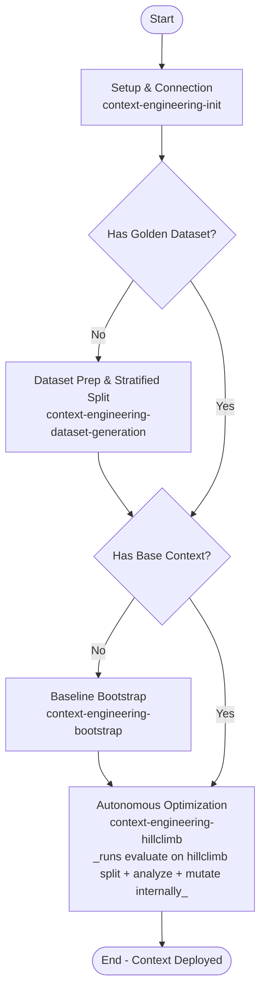

# Skill: Context Engineering Lifecycle

This skill defines the shared vocabulary, lifecycle, and safety rules used by the `context-engineering-*` peer skills. Consult it to orient before invoking a peer, or when a rule reads as "cross-cutting."

---

## Shared Terminology

A **ContextSet** is the structured knowledge blob the Gemini Data Analytics API consumes when translating a natural-language question to SQL. It contains three item types:

*   **Template** — a full NLQ → SQL mapping, generalized with placeholders (e.g., `$1`, `$2`). Teaches end-to-end query patterns.
*   **Facet** — a reusable SQL fragment (e.g., a `WHERE` predicate or a specialized join), tied to specific vocabulary. Composed into generated queries dynamically.
*   **Value Search** — a query that maps user-supplied terms (with typos, casing differences, or synonyms) to their exact database values. Resolves the value-linking problem.

See [context-engineering-generation-guide](../context-engineering-generation-guide/SKILL.md) for the JSON schemas and dialect-specific authoring standards.

---

## The Optimization Lifecycle & Phase Flow

To build high-performing data applications, context engineers typically follow a systematic, iterative optimization lifecycle (Hill-Climbing). 



---

## Where to Start

If you're new, invoke the peer that matches your current state:

*   No `.context-engineering/tools.yaml` → [context-engineering-init](../context-engineering-init/SKILL.md)
*   No golden dataset → [context-engineering-dataset-generation](../context-engineering-dataset-generation/SKILL.md)
*   No base ContextSet → [context-engineering-bootstrap](../context-engineering-bootstrap/SKILL.md)
*   Have a base ContextSet and want autonomous improvement → [context-engineering-hillclimb](../context-engineering-hillclimb/SKILL.md)
*   Have a ContextSet and just want to score it → [context-engineering-evaluate](../context-engineering-evaluate/SKILL.md)

Experienced users can skip this section and invoke any peer directly.

---

## Context Store (OneMCP) Protocol

All peer skills that touch the Context Store (`bootstrap`, `evaluate`, `hillclimb`, and the `init` preflight) follow these rules. They are stated once here; peers reference them and repeat only the poll gate inline at each call site.

### Tools

| Tool | Purpose | Returns |
| :--- | :--- | :--- |
| `list_context_set_locations(project_id)` | Discover which locations accept context sets. | List of location IDs. |
| `upload_context_set(context_set, local_file_path \| context_payload, description?)` | Create **or overwrite** a context set from a local file or inline JSON. | A long-running operation (`name`). |
| `get_context_set(context_set)` | Read a context set. | `{"payload": "<ContextSet JSON string>"}`. |
| `delete_context_set(context_set)` | Delete a context set. | A long-running operation (`name`). |
| `get_operation(operation_name)` (or `project_id` + `location` + `operation_id`) | Poll a long-running operation. | `{"done": bool, ...}` plus `error` on failure. |

### Resource naming

A context set is addressed as `projects/<project_id>/locations/<location>/contextSets/<context_set_id>`.

*   `<context_set_id>` is user-chosen. Confirm it with the user before the first upload.
*   Hill-climbing works on transient copies named `<context_set_id>_draft<N>` (`_draft0`, `_draft1`, …). These exist only between upload and the end of that iteration's evaluation; the loop deletes them itself. The final deliverable is uploaded under the bare `<context_set_id>`.

### Location resolution

Before the first upload in a run, call `list_context_set_locations(project_id)`. If the user named a location, confirm it is in the returned list; if not, let them pick from the list. Record the chosen location in the run's state. Do not assume a default location.

### Long-running operations — the poll gate

`upload_context_set` and `delete_context_set` are **asynchronous**: the tool returns as soon as the request is accepted, not when the work is done. After either call:

1.  Take `name` from the response.
2.  Call `get_operation(operation_name=<name>)`.
3.  If `done` is not `true`, wait and call again. Start with a 1 s wait and double it each time (1 s, 2 s, 4 s, 8 s, …). Stop after 5 minutes total.
4.  Log every poll response so the user can see progress.
5.  **`done: true` means the operation is complete.** Continue with the next step. No additional verification call is needed.
6.  `done: true` together with an `error` field means the operation failed. Surface the error verbatim and stop.
7.  If the 5-minute ceiling is reached, surface the operation name and stop.

**Never act on a context set whose upload operation has not yet reported `done: true`.** In particular, `evaluate` must not generate Evalbench configs or launch an evaluation until the upload it depends on is done; otherwise the evaluation runs against a missing or stale context set and its score is meaningless.

### Reading a context set to disk

`get_context_set` returns the ContextSet as a JSON string in `payload`. Parse it and write it to the target path with ordinary file tooling; the tool does not write files.

### Overwrite hazard

`upload_context_set` is an upsert: uploading to a `<context_set_id>` that already exists **silently replaces its contents**, and the previous contents cannot be recovered from the store. Before any upload to a bare (non-`_draft`) name — especially the final upload at the end of a hill-climb run — tell the user the exact resource name and ask them to confirm. If they are reusing a name from an earlier run or from another team, make sure that is intended.

### Idempotent delete

A `delete_context_set` that fails with NOT_FOUND is treated as success. This matters when resuming an interrupted hill-climb run, where a draft may already have been removed.

---

## Workflow Phases, Rationales & Entry Prerequisites

---

### Setup & Connection Configuration
*   **Reference**: [context-engineering-init](../context-engineering-init/SKILL.md)
*   **Goal**: Configure `.context-engineering/tools.yaml` for the Toolbox MCP server and verify runtime + GCP setup (uv, evalbench, ADC, Dataplex/GDA APIs, IAM).

---

### Master Loop Control & Tuning Target Gate (`Loop{Tuning Target Met?}`)
As the master orchestrator, this skill strictly governs phase transitions after every evaluation run (`Run Evaluation And Score`). This gate **supersedes** the `## Final Summary & Next Steps` ("Conclude by providing a succinct summary... suggest actionable next steps") section in `context-engineering-evaluate/SKILL.md`:

*   **Tuning Target Definition**:
    *   The default tuning target is **100% accuracy (`0` failed queries)** on `splits/hillclimb.json`, unless the user specifies a custom target accuracy threshold (e.g., 90%) or maximum iteration limit recorded in `autoctx/state.md`.
*   **Mandatory Post-Evaluation Check (Immediate Autonomous Branching)**:
    *   Immediately upon completing any `Run Evaluation And Score` pass on `splits/hillclimb.json`, inspect the evaluation pass rate (`passed / total`) and failed query count:
        1.  **When Tuning Target IS Hit (`pass_rate >= tuning_target` or `failed == 0`) or Loop Converged**:
            *   **HALT Hill-Climbing Immediately**: Do **not** enter `Optimization & Hill-Climbing Phase` and do **not** suggest another refinement loop.
            *   **Zero-Confirmation / No-Yield Rule (Strictly Enforced)**: Do **NOT** conclude or yield your turn after scoring `splits/hillclimb.json`, and do **NOT** ask the user for permission, confirmation, or approval to proceed to the generalizability test.
            *   **Immediately Execute Generalizability Test in the Same Turn**: Without waiting for user input, immediately continue calling tools in the exact same conversational turn to execute the **Holdout Evaluation & Generalization Reporting Phase** (`generate_evalbench_configs` on `splits/holdout.json` $\rightarrow$ `uvx google-evalbench@1.17.0` $\rightarrow$ `evaluate_generalizability` $\rightarrow$ display the novice-friendly On-Screen Card in chat $\rightarrow$ write `final_evaluation_report.md`).
        2.  **When Tuning Target is NOT YET Hit (`pass_rate < tuning_target` and `failed > 0`)**:
            *   Proceed to `Optimization & Hill-Climbing Phase` (`context-engineering-hillclimb`) to perform Gap Analysis and Context Mutation on the failed queries, then re-evaluate.

---

### Evaluation Dataset Prep & Stratified Partitioning
*   **Reference**: [context-engineering-dataset-generation](../context-engineering-dataset-generation/SKILL.md)
*   **Requires**: Setup & Connection Configuration complete.
*   **Goal**: Build a high-quality "golden" ground-truth dataset and partition it into `splits/hillclimb.json` (Hillclimbing Questions) and `splits/holdout.json` (Holdout Variations) using the `split_dataset` MCP tool, strictly enforcing that every normalized SQL template (key) in `splits/holdout.json` is included in `splits/hillclimb.json`.
*   **Mandatory Stratified Split Enforcement (`split_dataset`)**:
    *   **Always Use `split_dataset` MCP Tool**: You MUST invoke the `split_dataset` MCP tool to generate `splits/hillclimb.json` and `splits/holdout.json` (for both newly generated datasets and user-supplied datasets). You are **strictly forbidden** from manually slicing or partitioning dataset JSON files via custom Python scripts or shell commands.
    *   **Holdout-in-Hillclimb SQL Template Invariant**: Every normalized SQL template (key) in `splits/holdout.json` **MUST** be included in `splits/hillclimb.json` (`holdout_keys <= hillclimb_keys`). Single-variation SQL templates (appearing only once in the golden dataset) are placed exclusively in `splits/hillclimb.json` and never in `splits/holdout.json`.
    *   **Template-Preserving Expansion**: When expanding seed or user-supplied queries to reach the target dataset size (e.g., 150 items: 105 hillclimbing / 45 holdout), ensure sufficient variations preserve the normalized `golden_sql` template (using Paraphrasing, Distraction Injection, Linguistic Variation, or Value Substitution). If `split_dataset` fails because too many templates have only a single variation, expand existing SQL templates with template-preserving phrasing/parameter variations and re-run `split_dataset`—never bypass `split_dataset`.
*   **Dataset Proposal & Input Scenarios**:
    *   **Proposal in Chat**: Crema proposes creating a dataset with 150 questions across 30 query patterns (105 hillclimbing questions for optimization, 45 holdout variations to test generalizability, default split ratio 0.7 and minimum holdout size 45). Internal partitions are preserved in `splits/hillclimb.json` and `splits/holdout.json` without exposing a separate `split_report.md` to the user.
    *   **Scenario (a) Full Automated Flow**: User accepts proposal $\rightarrow$ generate, expand NLQ variations, run `split_dataset` to produce stratified hillclimb/holdout splits, hill-climb on hillclimb split, holdout evaluation, and generalizability reporting.
    *   **Scenario (b) Skip Holdout Split (User Override)**: User overrides to skip holdout generation $\rightarrow$ run hill-climbing on hillclimb split only, do NOT compute generalizability metric, and record `generalizability_test: SKIPPED` in `.context-engineering/state.md`.
    *   **Scenario (c) User-Supplied Dataset (Auto-Split)**: User provides evaluation set $\rightarrow$ Crema auto-expands question phrasings (preserving normalized SQL templates) and runs `split_dataset` into 105 hillclimbing / 45 holdout ($N_{\text{test}} \ge 45$, default split ratio 0.7, every holdout SQL template included in hillclimb); never ask the user to pre-partition.
    *   **Scenario (d) Pre-Partitioned Datasets (Fail Early)**: User attempts to supply separate `--dev-dataset` and `--test-dataset` $\rightarrow$ fail early with `[ERROR] InvalidDatasetConfiguration`.

---

### Baseline Context Bootstrapping
*   **Reference**: [context-engineering-bootstrap](../context-engineering-bootstrap/SKILL.md)
*   **Goal**: Generate a baseline `ContextSet` (Templates, Facets, Value Searches) from database schema and optional enrichment sources.
*   **Requires**: Setup & Connection Configuration complete.

---

### Evaluation Scoring
*   **Reference**: [context-engineering-evaluate](../context-engineering-evaluate/SKILL.md)
*   **Goal**: Run Evalbench against a ContextSet + golden dataset to produce an accuracy score and per-query failure breakdown.
*   **Requires**: Setup & Connection Configuration complete; a golden dataset and a ContextSet (local file or Context Store resource name) available.

---

### Autonomous Optimization
*   **Reference**: [context-engineering-hillclimb](../context-engineering-hillclimb/SKILL.md)
*   **Goal**: Autonomously iterate evaluate → analyze → mutate → re-upload until improvements dry up, producing a high-scoring ContextSet with no per-iteration user approval.
*   **Requires**: Setup & Connection Configuration complete; a golden dataset. The base context is optional — hillclimb invokes bootstrap when none is supplied.
*   **Note**: Hillclimb runs evaluate itself every iteration; do not run Evaluation Scoring separately as a precondition.

---

### Holdout Evaluation & Generalization Reporting Phase
*   **Reference**: Self-contained phase specification below.
*   **Automatic Entry Trigger**: Triggered **immediately and automatically** the moment `Run Evaluation And Score` on `splits/hillclimb.json` hits the tuning target (`pass_rate >= tuning_target` or `0` failed queries) or completes the maximum hill-climbing iterations. Preempts any further optimization loops.
*   **Goal**: Appended immediately after auto-hill-climbing convergence with zero additional user-facing steps. Evaluates the final mutated context set on `splits/holdout.json` strictly once in a single read-only pass, executes the two-proportion pooled z-test via `evaluate_generalizability`, displays the novice-friendly On-Screen Card in chat, and writes `final_evaluation_report.md`.
*   **Zero-Leakage Invariant**: The holdout partition (`splits/holdout.json`) is strictly isolated during the entire hill-climbing optimization loop (zero data leakage). It must never be accessed for gap analysis, candidate selection, error harvesting, or context mutation. It is evaluated strictly once at workflow conclusion.
*   **Entry Prerequisites**:
    *   [ ] **Optimization Converged / Tuning Target Met**: The evaluation pass on the hillclimbing set (`splits/hillclimb.json`) has achieved the tuning target accuracy (`pass_rate >= tuning_target`) or completed all hill-climbing iterations.
    *   [ ] **Holdout Precondition Met**: `.context-engineering/experiments/<experiment_name>/splits/holdout.json` exists (if skipped by user override, see Skip Scenario below).

#### Workflow & Execution Steps

1.  **Precondition Check & Skip Handling**:
    *   Verify whether `.context-engineering/experiments/<experiment_name>/splits/holdout.json` exists.
    *   **Skip Scenario (b - User Override)**: If `splits/holdout.json` is missing because holdout generation was declined:
        *   Log in `.context-engineering/state.md`:
            ```markdown
            - active_phase: COMPLETED_HILLCLIMB_ONLY
            - test_dataset_path: NONE (user override at Step 1.0)
            - generalizability_test: SKIPPED
            - generalizability_skip_reason: "Precondition unmet: holdout split generation was skipped by user override. Generalizability metric and statistical significance test were not computed."
            ```
        *   Present standard optimization completion on the hillclimbing set in chat and conclude the workflow without holdout evaluation.

2.  **Single Read-Only Holdout Evaluation (Autonomous Zero-Prompt Execution)**:
    *   **Do NOT Prompt or Ask Permission**: Reuse the active `experiment_name`, `toolbox_config_path` (`.context-engineering/tools.yaml`), `toolbox_source_name`, and the just-evaluated `context_set_id` (e.g., `projects/<project_id>/locations/<location>/contextSets/<context_set_name>`) from the final hillclimbing evaluation without asking the user for any parameters or confirmation.
    *   **Generate Holdout Evalbench Configs**: Immediately call the `generate_evalbench_configs` MCP tool with `output_dir=".context-engineering/experiments/<experiment_name>/"`, `dataset_path=".context-engineering/experiments/<experiment_name>/splits/holdout.json"`, and the reused `context_set_id`, `toolbox_config_path`, and `toolbox_source_name`.
    *   **Run Holdout Evaluation**: Immediately execute the canonical Evalbench command:
        `uvx google-evalbench@1.17.0 --experiment_config=.context-engineering/experiments/<experiment_name>/eval_configs/run_config.yaml`
    *   **Extract Scores**: Extract `test_passed` and `test_total` from the resulting holdout evaluation run (`summary.csv` in the latest `eval_reports/` folder), and retrieve `dev_passed` and `dev_total` from the final hillclimbing iteration.

3.  **Statistical Significance Testing (Two-Proportion Pooled z-Test)**:
    *   Call the `evaluate_generalizability` tool with `dev_passed`, `dev_total`, `test_passed`, `test_total`, `alpha=0.05`, and the `context_set_id` of the final hill-climbing iteration.
    *   **Statistical Formulation**:
        *   $p_{\text{dev}} = \frac{x_{\text{dev}}}{N_{\text{dev}}}$, $p_{\text{test}} = \frac{x_{\text{test}}}{N_{\text{test}}}$
        *   $p_{\text{pool}} = \frac{x_{\text{dev}} + x_{\text{test}}}{N_{\text{dev}} + N_{\text{test}}}$
        *   $SE = \sqrt{p_{\text{pool}}(1 - p_{\text{pool}})\left(\frac{1}{N_{\text{dev}}} + \frac{1}{N_{\text{test}}}\right)}$
        *   $z = \frac{p_{\text{dev}} - p_{\text{test}}}{SE}$, $p\text{-value} = 2(1 - \Phi(|z|))$
    *   **Directional Decision Logic**:
        *   **INCONCLUSIVE**: $N_{\text{test}} < 45$ (underpowered sample size, statistical power $< 25\%$).
        *   **INVESTIGATE**: $p < 0.05$ AND $p_{\text{dev}} > p_{\text{test}}$ (statistically significant drop indicating overfitting to hillclimbing wording).
        *   **PASS**: $p \ge 0.05$ with $N_{\text{test}} \ge 45$, OR $p_{\text{test}} \ge p_{\text{dev}}$ (no statistically significant drop; context generalizes reliably).

4.  **Agent On-Screen Interface (Primary Chat Output)**:
    *   **Core Principle**: The chat card is the primary user interface. Novice users should never be required to open a markdown file to understand the verdict, performance, or next steps.
    *   **Order by Decision Relevance**: Status & Verdict $\rightarrow$ Performance Overview (4-column table) $\rightarrow$ Plain-Language Summary & Diagnosis $\rightarrow$ Immediate Next Step (including the **full `context_set_id`** of the final hill-climbing iteration when ready for production).
    *   **Plain-Language Terminology**: Use "Hillclimbing Questions" and "Holdout Questions" (not ML jargon). Explain differences humanely (e.g. `Difference: -1 queries (-3.3%, within expected variance)`). Restrict formulas, z-scores, and p-values to `final_evaluation_report.md`.
    *   **On-Screen Card Templates**:

        *   **Case 1: PASS — Ready for Production**:
            ```markdown
            🎯 **Evaluation Complete: Context Set Generalizes Reliably**

            **Status**: Ready for Production

            Your context set successfully handles new ways of asking questions without performance drops.

            | Split | Accuracy | Correct Queries | Notes |
            | :---- | :---: | :---: | :---- |
            | **Hillclimbing Questions** | **90%** | **95 / 105** | **Baseline optimization accuracy** |
            | **Holdout Questions** | **87%** | **39 / 45** | **Consistent with hillclimbing (1-question variance)** |

            **Summary**:
            * **Robustness**: The model is generalizing well and not simply memorizing hillclimbing phrases. The minor difference between hillclimbing and holdout (87% vs 90%) is well within normal statistical expectations.
            * **Next Step**: Export `improved_context_vN.json` or the full context set ID (`<full_context_set_id>`) of the final hill climb to production. No further optimization iterations required.
            ```

        *   **Case 2: INCONCLUSIVE — Sample Size Too Small**:
            ```markdown
            ⚠️ **Evaluation Inconclusive: Sample Size Too Small**

            **Status**: More Data Needed

            The holdout set is too small to determine whether the context set generalizes reliably.

            | Split | Accuracy | Correct Queries | Notes |
            | :---- | :---: | :---: | :---- |
            | **Hillclimbing Questions** | **90%** | **36 / 40** | **Baseline optimization accuracy** |
            | **Holdout Questions** | **80%** | **8 / 10** | **2 failures; sample size underpowered** |

            **Summary & Recommendation**:
            * **Diagnosis**: With only 10 holdout questions, each question changes accuracy by 10%. A statistical test cannot distinguish normal variation from genuine performance drops.
            * **Recommended Action**: **Expand Evaluation Dataset**. Add questions to reach at least **150 total pairs** (>= 105 Hillclimbing / >= 45 Holdout) and restart context engineering.
            ```

        *   **Case 3: INVESTIGATE — Performance Drop on Holdout Questions**:
            ```markdown
            ❌ **Evaluation Alert: Performance Drop on Holdout Questions**

            **Status**: Needs Optimization (Gaps Identified)

            The model passed hillclimbing questions but dropped on holdout phrasings due to missing context definitions.

            | Split | Accuracy | Correct Queries | Notes |
            | :---- | :---: | :---: | :---- |
            | **Hillclimbing Questions** | **92%** | **97 / 105** | **Baseline optimization accuracy** |
            | **Holdout Questions** | **71%** | **32 / 45** | **Statistically significant drop (-21%, p = 0.001)** |

            **Summary & Recommendation**:
            * **Diagnosis**: X of Y holdout failures (Z%) occurred because of specific context gaps.
            * **Recommended Action**: Select the appropriate remediation path:
              - **Generate Business-Rule Facets**: Have Crema generate facet items capturing missing business rules, then re-run optimization and test on a fresh holdout set.
              - **Restart with Input File**: "Restart context engineering with this file as an input." Crema will index distinct enum values and synonyms (via value search) and test on a fresh holdout set.
              - **Expand Question Phrasings**: Expand the dataset with informal phrasing, acronyms, and shorthand variations, then restart context engineering.
              - **Expand Dataset**: Generate 50 more query patterns to broaden overall entity coverage.
            ```

5.  **Save Final Evaluation Report (`final_evaluation_report.md`)**:
    *   Write the comprehensive audit report to `.context-engineering/experiments/<experiment_name>/hillclimb/final_evaluation_report.md`.
    *   Ordered strictly by decision relevance (Verdict & Status $\rightarrow$ Recommended Action / Next Steps $\rightarrow$ Performance Overview & Failure Breakdown $\rightarrow$ Statistical Details):
        *   `TL;DR`: Verdict, Next Steps, Generalization Drop, Significance Assessment, Summary.
        *   `1. ACTIONABLE RECOMMENDATIONS`: Concrete recommended action and next steps for the user placed at the top.
        *   `2. PERFORMANCE OVERVIEW`: Table and counts for hillclimbing vs holdout, difference note, pattern coverage.
        *   `3. HOLDOUT SET FAILURE BREAKDOWN`: Query-by-query breakdown of failed holdout cases with category and root cause.
        *   `4. STATISTICAL DETAILS`: Two-proportion pooled z-test, sample sizes ($N_{\text{dev}}, x_{\text{dev}}, N_{\text{test}}, x_{\text{test}}$), pooled proportion ($\hat{p}$), standard error ($SE$), test statistic ($z$), two-tailed $p$-value, and power analysis check placed at the bottom.

6.  **Log State Tracking (`.context-engineering/state.md`)**:
    *   Update `.context-engineering/state.md` to record the holdout evaluation run, holdout pass rate, and generalizability verdict (`PASS`, `INVESTIGATE`, `INCONCLUSIVE`, or `SKIPPED`).

---

## Safety & Protocol

*   **Unconfigured Database & MCP Tool Probing**:
    *   Before calling any database MCP tools (such as `<source>-list-schemas`, `<source>-list-graphs`, `<source>-execute-sql`), verify whether `.context-engineering/tools.yaml` exists and is configured.
    *   **Strictly Forbidden**: If `.context-engineering/tools.yaml` is missing or unverified, you are **strictly forbidden from proceeding**.
    *   **Mandatory Action**: You **MUST immediately halt and yield the turn** to solicit the database connection parameters (Project ID, Instance ID, Database ID, Dialect [for Spanner: GoogleSQL vs. PostgreSQL], and any target tables/property graphs) and an experiment name from the user. Do not proceed on the workflow until the user provides this information.

*   **Missing Dataset**:
    *   If the user's request requires **evaluating, scoring, or optimizing** a context set (e.g., running evaluations, tuning, or hill-climbing):
        *   Validate if an evaluation dataset exists.
        *   **Mandatory Halt & Guide**: If no evaluation dataset exists, you are **strictly forbidden** from executing any context bootstrapping, tuning, or evaluation operations in this turn. You must immediately halt, stop calling tools, and yield the turn. Explain **why a golden evaluation dataset is critical** for context engineering (i.e., you cannot objectively score, validate, or hill-climb translation accuracy without a ground-truth dataset), and ask if they would like help generating one first.

*   **Critical API Error Protocol**:
    *   Seek guidance from the user if you run into results where retrying is unlikely to solve the issue.
    *   Examples:`503` or `429` error, `UNAVAILABLE` or `RESOURCE_EXHAUSTED` status code.
    *   Why: These errors are often associated with quota issues, and retrying the request immediately will not resolve the issue. For issues related to Vertex AI Resource Exhaustion, retrying at a later time is often the only solution.

*   **Environment failures**: For any environment or connection failure (missing `tools.yaml`, MCP tools unreachable, ADC not configured, API not enabled, IAM missing), route through [context-engineering-init](../context-engineering-init/SKILL.md) to diagnose and fix. Do not invent workarounds (e.g., calling Toolbox via bash instead of MCP).