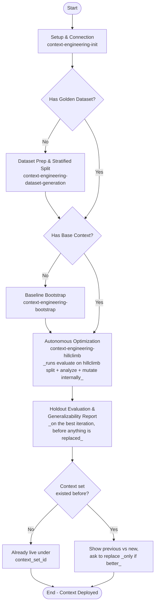

# Skill: Context Engineering Lifecycle

This skill defines the shared vocabulary, lifecycle, and safety rules used by the `context-engineering-*` peer skills. Consult it to orient before invoking a peer, or when a rule reads as "cross-cutting."

---

## Shared Terminology

A **ContextSet** is the structured knowledge blob the Gemini Data Analytics API consumes when translating a natural-language question to SQL. It contains three item types:

*   **Template** — a full NLQ → SQL mapping, generalized with placeholders (e.g., `$1`, `$2`). Teaches end-to-end query patterns.
*   **Facet** — a reusable SQL fragment (e.g., a `WHERE` predicate or a specialized join), tied to specific vocabulary. Composed into generated queries dynamically.
*   **Value Search** — a query that maps user-supplied terms (with typos, casing differences, or synonyms) to their exact database values. Resolves the value-linking problem.

See [context-engineering-generation-guide](../context-engineering-generation-guide/SKILL.md) for the JSON schemas and dialect-specific authoring standards.

---

## The Optimization Lifecycle & Phase Flow

To build high-performing data applications, context engineers typically follow a systematic, iterative optimization lifecycle (Hill-Climbing). 



---

## Kick-off: what to tell the user first

When a user starts (or asks how to start), give a **short, plain-language briefing** before asking anything — five lines, not a lecture. Do **not** recite phases, split ratios, draft/publish mechanics or holdout statistics up front; each phase explains itself when it begins, and detail is available on request. Template:

> * **Goal** — build a Context Set (what the Gemini Data Analytics API uses to turn your users' questions into SQL) and improve it until it answers reliably: connect → test questions → first Context Set → improve in rounds → check on unseen questions.
> * **Experiment** — everything for one attempt lives in `.context-engineering/experiments/<name>/`; you can run several against the same database and compare them.
> * **`state.md`** — records your choices once (database, project/location, Context Set name, upload approval) and then every round's score and the final result, so I never ask twice.
> * **I'll need** — the database connection (if not set up yet), project + location, a name for the Context Set (default: the experiment name), and whether to pause before each upload (default) or upload automatically.

Then ask which situation applies and route:

*   No experiment workspace yet, the shared `.context-engineering/tools.yaml` is missing, or `.context-engineering/experiments/<experiment_name>/state.md` is missing → [context-engineering-init](../context-engineering-init/SKILL.md)
*   Finished experiment (`state.md` has `## Final:`) and you want to improve further → [context-engineering-init](../context-engineering-init/SKILL.md) in **clone mode** (see *Next experiment hand-off*); never hill-climb a finished experiment again
*   No golden dataset (`dataset/golden.json` missing in the experiment) → [context-engineering-dataset-generation](../context-engineering-dataset-generation/SKILL.md)
*   No base ContextSet → [context-engineering-bootstrap](../context-engineering-bootstrap/SKILL.md)
*   Have a base ContextSet and want autonomous improvement → [context-engineering-hillclimb](../context-engineering-hillclimb/SKILL.md)
*   Have a context set **already published on the Context Set server** (`projects/…/locations/…/<collection>/<id>`) and want to fix it iteratively → [context-engineering-init](../context-engineering-init/SKILL.md) in **existing-context-set mode** (parses the name, asks same name vs new name), then hillclimb seeds `v0` from it — see *Improving a context set that already exists on the Context Set server*
*   Have a ContextSet and just want to score it → [context-engineering-evaluate](../context-engineering-evaluate/SKILL.md)

Experienced users who state their coordinates and preferences up front skip the briefing; take what they gave, confirm only what is missing, and invoke the peer directly.

---

## Context Set (OneMCP) Protocol

All peer skills that touch the Context Set server (`bootstrap`, `evaluate`, `hillclimb`, and the `init` preflight) follow these rules. They are stated once here; peers reference them and repeat only the poll gate inline at each call site.

### Connection

The Context Set tools are served **directly by the remote OneMCP Context Set server** (a Dataplex MCP endpoint), not by this plugin's local MCP server. The plugin manifests register that remote server under the key `contextmgmt` with Google-credentials auth; the agent client (Antigravity / Jetski / Gemini CLI) attaches an Application Default Credentials bearer token automatically. If the five tools below are not visible in your tool list, the remote server is not connected: route to [context-engineering-init](../context-engineering-init/SKILL.md), which checks the connection and explains the fix (`gcloud auth application-default login` with a quota project, then reload MCP servers). Never substitute local HTTP calls (`curl`, `requests`) for these tools.

### Tools

Every tool identifies a context set by three separate arguments — `project_id`, `location`, `context_set_id` — never by a single resource-name string.

| Tool | Purpose | Returns |
| :--- | :--- | :--- |
| `list_context_set_locations(project_id)` | Discover which locations accept context sets. | `{"locations": [...]}`. |
| `upload_context_set(project_id, location, context_set_id, context_payload, description?, databases?)` | Create **or overwrite** a context set from an inline JSON string. There is **no file-path argument**; see *Writing a context set from disk*. | A long-running operation (`name`). |
| `get_context_set(project_id, location, context_set_id)` | Read a context set. | `{"payload": "<ContextSet JSON string>", "description", "display_name", "databases"}`. |
| `delete_context_set(project_id, location, context_set_id)` | Delete a context set. | A long-running operation (`name`). |
| `get_operation(project_id, location, operation_id)` | Poll a long-running operation. | `{"done": bool, ...}` plus `error` on failure. |

### Resource naming

A context set resource name has the shape

```
projects/<project_id>/locations/<location>/<collection>/<context_set_id>
```

where `<collection>` is the service's collection segment — **`contextSets` today, expected to become `entryGroups`**. The skills never depend on that segment:

*   **Parsing (always by position, never by validating the collection):** `project_id` = the segment after `projects`, `location` = the segment after `locations`, `context_set_id` = the **last** segment. Accept any collection segment; if the name does not have the `projects/…/locations/…/<collection>/<id>` structure at all, ask the user to re-check it rather than guessing.
*   **Calling tools:** every tool takes the three parsed parts (`project_id`, `location`, `context_set_id`) — never the full string — so the collection segment is irrelevant to tool calls.
*   **Recording names in `state.md`:** when the user supplied a resource name, record it **verbatim** as the resource it refers to (`Seed resource`, and `Final resource` when improving in place). Derive the `Draft resource` from it by replacing only the last segment with `<context_set_id>_draft`, keeping the user's collection segment. Only when *no* name was supplied (fresh experiment) construct `Final resource` / `Draft resource` with the current default collection `contextSets`. If a tool response carries a resource `name`, prefer that string verbatim over a constructed one.
*   **Passing names to Evalbench:** `generate_evalbench_configs(context_set_id=…)` passes the string straight through to Evalbench/QueryData; give it the recorded resource string unchanged.

> [!IMPORTANT]
> **This section is the only definition of the resource-name shape.** Peer skills (`init`, `bootstrap`, `evaluate`, `hillclimb`) and the examples in `context-engineering-hillclimb/references/workspace.md` refer to it as *the Resource naming rule* and must not spell out a different path. When the service switches collection, change the default collection word above and the `workspace.md` examples; nothing else should need to change.

*   `<context_set_id>` is user-chosen. `context-engineering-init` asks for it once (default: the experiment name) and records it in `state.md`; peers read it from there.
*   **Working copy — decided by whether `<context_set_id>` already exists when init probes it**, and recorded as the `Draft resource` bullet:
    *   **Fresh** (did not exist): there is **no `_draft`**. Hill-climbing uploads every iteration straight to `<context_set_id>`, re-uploads the best iteration to the same name at the end, and runs the holdout test on it. Nothing is deleted. `Draft resource: (none — new context set; iterations upload to the final name)`.
    *   **Existing** (already there): hill-climbing uploads every iteration to `<context_set_id>_draft` and **never writes to `<context_set_id>` during the run**. At the end the best iteration is placed in the draft, the holdout test runs on the draft, and the user is asked — always, regardless of `Auto-approve uploads`, and only if the candidate beats `v0` — whether to replace the existing set. The draft is deleted afterwards either way. `Draft resource: …/<context_set_id>_draft`.

### Improving a context set that already exists on the Context Set server

When the user hands over an existing resource name ("improve / fix `projects/…/<collection>/<id>`"), `context-engineering-init` parses it (rule above), confirms it exists, pre-fills `Project` and `Location`, records it **verbatim** as `Seed resource`, and asks **one** question — should the improved version replace it (**same name**, the default) or be published under a **new name**?

*   **Same name** → `Context set id` = parsed `<id>`, `Final resource` = the supplied string. Because the name exists, the *existing* working-copy rule applies automatically: iterations run on `<id>_draft`, the original is untouched until the end-of-run HITL, and the original payload is kept locally as `v0/context_set_v0.json`.
*   **New name** → `Context set id` = the new name; it does not exist, so the *fresh* rule applies and the seed is never written to.

In both cases hillclimb seeds `v0` from the existing resource via `get_context_set` (not bootstrap). No extra bookkeeping (`Publish mode` or similar) is needed — the `Seed resource`, `Final resource` and `Draft resource` bullets fully determine the behaviour.

### Location resolution

Location is resolved **once**, by `context-engineering-init`: it calls `list_context_set_locations(project_id)`, lets the user pick (or confirms a named location is in the list), and records the choice in the experiment `state.md`. When the user supplied an existing resource name, the location parsed from it is used and only confirmed against the list — not re-asked. Peers read `Location` from `state.md` and do not call `list_context_set_locations` again. Do not assume a default location.

### Writing a context set from disk

`upload_context_set` accepts the ContextSet only as an inline JSON string in `context_payload`. To upload a file:

1.  Run `validate_context_set` (local plugin tool) on the file. Do not upload a file that fails validation.
2.  Read the file with ordinary file tooling.
3.  Call `upload_context_set` with `context_payload` set to the **exact, complete** file contents. Do not summarise, reformat, truncate, or "fix" the JSON on the way through; the payload must round-trip byte-for-byte in meaning.
4.  Follow the poll gate below.

### Long-running operations — the poll gate

`upload_context_set` and `delete_context_set` are **asynchronous**: the tool returns as soon as the request is accepted, not when the work is done. After either call:

1.  Take `name` from the response. It has the form `projects/<project_id>/locations/<location>/operations/<operation_id>`; the `operation_id` is the last path segment.
2.  Call `get_operation(project_id=…, location=…, operation_id=…)` with those three parts.
3.  If `done` is not `true`, wait **at least 5 seconds** and call again (the server asks for ≥5 s between polls). Stop after 5 minutes total.
4.  Log every poll response so the user can see progress.
5.  **`done: true` means the operation is complete.** Continue with the next step. No additional verification call is needed.
6.  `done: true` together with an `error` field means the operation failed. Surface the error verbatim and stop.
7.  If the 5-minute ceiling is reached, surface the operation name and stop.

**Never act on a context set whose upload operation has not yet reported `done: true`.** In particular, `evaluate` must not generate Evalbench configs or launch an evaluation until the upload it depends on is done; otherwise the evaluation runs against a missing or stale context set and its score is meaningless.

### Reading a context set to disk

`get_context_set` returns the ContextSet as a JSON string in `payload`. Parse it and write it to the target path with ordinary file tooling; the tool does not write files.

### Overwrite hazard

`upload_context_set` is an upsert: uploading to a `<context_set_id>` that already exists **silently replaces its contents**, and the previous contents cannot be recovered from the server. The skills handle this structurally rather than with a one-time acknowledgement:

1.  `context-engineering-init` probes the bare `<context_set_id>`. If it exists, it **warns the user up front** (iterations will go to `_draft`; the existing set is untouched until the end; one `delete_context_set` on the draft will follow) and offers a different name.
2.  During the run, an existing `<context_set_id>` is **never written**.
3.  At the end, the holdout test runs on the candidate **before** anything is replaced, and the replacement is a **mandatory HITL** — previous vs new results side by side — asked only if the candidate beats `v0`, and regardless of `Auto-approve uploads`. The previous contents are preserved locally as `v0/context_set_v0.json` and can be re-uploaded on request.

A fresh `<context_set_id>` (NOT_FOUND at init) needs none of this: it is created by the first iteration upload and never contained anything else.

### Idempotent delete

A `delete_context_set` that fails with NOT_FOUND is treated as success. This matters when resuming an interrupted hill-climb run, where a draft may already have been removed.

---

## Workflow Phases, Rationales & Entry Prerequisites

---

### Setup & Connection Configuration
*   **Reference**: [context-engineering-init](../context-engineering-init/SKILL.md)
*   **Goal**: Ensure the shared `.context-engineering/tools.yaml` exists for the Toolbox MCP server (one file per workspace; it may hold several DB sources; it is **never** copied into an experiment), verify runtime + GCP setup (uv, evalbench, ADC, Dataplex/GDA APIs, IAM), and create the experiment workspace `.context-engineering/experiments/<experiment_name>/` with its `state.md` (and later `dataset/`). `state.md`'s `## Metadata` records the Context Set coordinates (`Project`, `Location`, `Context set id`, `Final resource`), the `Draft resource` bullet that encodes whether the final name already existed (none → iterate on the final name; `_draft` → iterate on a scratch copy and ask before replacing), optional `Seed resource`, `Auto-approve uploads`, enrichment sources, and — for follow-up experiments — `Cloned from`; its `## Active Database` records **which `tools.yaml` source this experiment uses** (source name, type, tool names, and for Spanner Graph `Graph Ids`). Stopping rules for the loop are **not** user settings and are not recorded — they are constants of `context-engineering-hillclimb`. Downstream peers read these values instead of re-asking. Every change to `tools.yaml` — by a skill or by the user — ends with an explicit reminder to **restart the `toolbox` MCP server**, which reads the file only at startup. Init can also **clone** a finished experiment (copying its `dataset/` in full or just `golden.json`, depending on the verdict) — see *Next experiment hand-off* below.

---

### Master Loop Control & Tuning Target Gate (`Loop{Tuning Target Met?}`)
As the master orchestrator, this skill strictly governs phase transitions after every evaluation run (`Run Evaluation And Score`). This gate **supersedes** the `## Final Summary & Next Steps` ("Conclude by providing a succinct summary... suggest actionable next steps") section in `context-engineering-evaluate/SKILL.md`:

*   **Stopping Conditions** (internal constants defined in `context-engineering-hillclimb` — not user settings, not stored in `state.md`; checked in this order after every evaluation):
    *   **Tuning target** — `TUNING_TARGET = 1.0`: **100% accuracy (`0` failed queries)** on `splits/hillclimb.json`.
    *   **Plateau** — `PLATEAU_K = 3`: the last 3 iterations all failed to beat the best score so far.
    *   **Iteration cap** — `MAX_ITERATIONS = 10` iterations have been evaluated.
    *   An explicit in-prompt override by a power user applies to the current session only.
*   **Mandatory Post-Evaluation Check (Immediate Autonomous Branching)**:
    *   Immediately upon completing any `Run Evaluation And Score` pass on `splits/hillclimb.json`, inspect the evaluation pass rate (`passed / total`) and failed query count:
        1.  **When any Stopping Condition fires** (`pass_rate >= tuning_target`, plateau, or iteration cap):
            *   **HALT Hill-Climbing Immediately**: Do **not** enter `Optimization & Hill-Climbing Phase` and do **not** suggest another refinement loop.
            *   **Finalize (hillclimb skill)**: put the best-scoring iteration `vK` in the **working copy** (re-upload if the last iteration was not the best; poll gate) and record `## Finalizing: vK`.
            *   **Zero-Confirmation / No-Yield Rule (Strictly Enforced)**: Do **NOT** conclude or yield your turn after scoring `splits/hillclimb.json`, and do **NOT** ask the user for permission, confirmation, or approval to proceed to the generalizability test.
            *   **Immediately Execute Generalizability Test in the Same Turn** against the **working copy** (`generate_evalbench_configs` on `splits/holdout.json` $\rightarrow$ `uvx google-evalbench@1.17.0` $\rightarrow$ `evaluate_generalizability` $\rightarrow$ write `final_evaluation_report.md` + `## Generalizability`).
            *   **Then set the publication state** (hillclimb Finalize step 4): fresh context set → it is already live under `<context_set_id>`, write `## Final:`; existing context set → the **one** HITL of the run (previous vs new, only if `vK` beats `v0`; replace or keep), delete `_draft`, write `## Final:`. Then display the On-Screen Card and, for non-PASS verdicts, the hand-off card.
        2.  **When no Stopping Condition fires (`pass_rate < tuning_target` and `failed > 0`)**:
            *   Proceed to `Optimization & Hill-Climbing Phase` (`context-engineering-hillclimb`) to perform Gap Analysis and Context Mutation on the failed queries, then re-evaluate.
        3.  **When the user explicitly asks to stop**: finish the current iteration cleanly, append `## User Stop` to `state.md`, and **do not finalize and do not run the holdout test**. A later resume offers the choice to continue or finalize.

---

### Evaluation Dataset Prep & Stratified Partitioning
*   **Reference**: [context-engineering-dataset-generation](../context-engineering-dataset-generation/SKILL.md)
*   **Requires**: Setup & Connection Configuration complete.
*   **Goal**: Build a high-quality "golden" ground-truth dataset at `.context-engineering/experiments/<experiment_name>/dataset/golden.json` and partition it into `dataset/splits/hillclimb.json` (Hillclimbing Questions) and `dataset/splits/holdout.json` (Holdout Variations) using the `split_dataset` MCP tool, strictly enforcing that every normalized SQL template (key) in `splits/holdout.json` is included in `splits/hillclimb.json`. The whole `dataset/` directory — golden set, splits, and the skill's working files (plan, environment report, interim dataset, audit reports) — lives **inside the experiment**; nothing is written to the current working directory. Follow-up experiments that must stay comparable with a finished one receive a **copy** of its `dataset/` via the init clone flow (`split_dataset` is deterministic, so copied splits are reproducible). Each experiment's `state.md` records the dataset paths under `## Metadata`.
*   **Mandatory Stratified Split Enforcement (`split_dataset`)**:
    *   **Always Use `split_dataset` MCP Tool**: You MUST invoke the `split_dataset` MCP tool to generate `splits/hillclimb.json` and `splits/holdout.json` (for both newly generated datasets and user-supplied datasets). You are **strictly forbidden** from manually slicing or partitioning dataset JSON files via custom Python scripts or shell commands.
    *   **Holdout-in-Hillclimb SQL Template Invariant**: Every normalized SQL template (key) in `splits/holdout.json` **MUST** be included in `splits/hillclimb.json` (`holdout_keys <= hillclimb_keys`). Single-variation SQL templates (appearing only once in the golden dataset) are placed exclusively in `splits/hillclimb.json` and never in `splits/holdout.json`.
    *   **Template-Preserving Expansion**: When expanding seed or user-supplied queries to reach the target dataset size (e.g., 150 items: 105 hillclimbing / 45 holdout), ensure sufficient variations preserve the normalized `golden_sql` template (using Paraphrasing, Distraction Injection, Linguistic Variation, or Value Substitution). If `split_dataset` fails because too many templates have only a single variation, expand existing SQL templates with template-preserving phrasing/parameter variations and re-run `split_dataset`—never bypass `split_dataset`.
*   **Dataset Proposal & Input Scenarios**:
    *   **Proposal in Chat**: Crema proposes creating a dataset with 150 questions across 30 query patterns (105 hillclimbing questions for optimization, 45 holdout variations to test generalizability, default split ratio 0.7 and minimum holdout size 45). Internal partitions are preserved in `splits/hillclimb.json` and `splits/holdout.json` without exposing a separate `split_report.md` to the user.
    *   **Scenario (a) Full Automated Flow**: User accepts proposal $\rightarrow$ generate, expand NLQ variations, run `split_dataset` to produce stratified hillclimb/holdout splits, hill-climb on hillclimb split, publish, holdout evaluation, and generalizability reporting.
    *   **Scenario (b) User-Supplied Dataset (Auto-Split)**: User provides evaluation set $\rightarrow$ Crema auto-expands question phrasings (preserving normalized SQL templates) and runs `split_dataset` into 105 hillclimbing / 45 holdout ($N_{\text{test}} \ge 45$, default split ratio 0.7, every holdout SQL template included in hillclimb); never ask the user to pre-partition.
    *   **Scenario (c) Pre-Partitioned Datasets (Fail Early)**: User attempts to supply separate `--dev-dataset` and `--test-dataset` $\rightarrow$ fail early with `[ERROR] InvalidDatasetConfiguration`.
    *   The split is **not optional**: there is no "skip holdout" path. Every golden dataset is split into `splits/hillclimb.json` and `splits/holdout.json`, and every completed hill-climb run ends with a holdout evaluation.

---

### Baseline Context Bootstrapping
*   **Reference**: [context-engineering-bootstrap](../context-engineering-bootstrap/SKILL.md)
*   **Goal**: Generate a baseline `ContextSet` (Templates, Facets, Value Searches) from database schema and optional enrichment sources.
*   **Requires**: Setup & Connection Configuration complete.

---

### Evaluation Scoring
*   **Reference**: [context-engineering-evaluate](../context-engineering-evaluate/SKILL.md)
*   **Goal**: Run Evalbench against a ContextSet + golden dataset to produce an accuracy score and per-query failure breakdown.
*   **Requires**: Setup & Connection Configuration complete; a golden dataset and a ContextSet (local file or Context Set resource name) available.

---

### Autonomous Optimization
*   **Reference**: [context-engineering-hillclimb](../context-engineering-hillclimb/SKILL.md)
*   **Goal**: Autonomously iterate evaluate → analyze → mutate → re-upload until improvements dry up, producing a high-scoring ContextSet with no per-iteration user approval.
*   **Requires**: Setup & Connection Configuration complete; a golden dataset. The base context is optional and can be **(a)** none — hillclimb invokes bootstrap, **(b)** a local ContextSet file, or **(c)** a context set **already published on the Context Set server**, given by resource name (any collection segment; see *Improving a context set that already exists on the Context Set server* — init records it as `Seed resource` and the user chooses in-place or new-name publishing; hillclimb downloads it as `v0`).
*   **Note**: Hillclimb runs evaluate itself every iteration; do not run Evaluation Scoring separately as a precondition.

---

### Holdout Evaluation & Generalization Reporting Phase
*   **Reference**: Self-contained phase specification below.
*   **Automatic Entry Trigger**: Invoked by `context-engineering-hillclimb` **Finalize step 3**, immediately after the loop stops (tuning target, plateau, or iteration cap) and the best iteration `vK` has been placed in the **working copy** (`## Finalizing: vK` present in `state.md`). It runs **before** any existing context set is replaced, so a poor verdict never costs the user their previous version. Preempts any further optimization loops. Not triggered after a `## User Stop`.
*   **Goal**: Zero additional user-facing steps. Evaluates the **candidate** — the working copy: the bare `<context_set_id>` in the fresh case, `<context_set_id>_draft` in the existing case — on `splits/holdout.json` strictly once in a single read-only pass, executes the two-proportion pooled z-test via `evaluate_generalizability`, writes `final_evaluation_report.md` and `## Generalizability`, and hands the verdict back to hillclimb Finalize (step 4) which decides the publication state; the On-Screen Card is printed after that decision.
*   **Zero-Leakage Invariant**: The holdout partition (`splits/holdout.json`) is strictly isolated during the entire hill-climbing optimization loop (zero data leakage). It must never be accessed for gap analysis, candidate selection, error harvesting, or context mutation. It is evaluated strictly once at workflow conclusion.
*   **Entry Prerequisites**:
    *   [ ] **Candidate in place**: `state.md` contains `## Finalizing: vK` and the working copy's last upload (of `vK`) has reported `done: true`.
    *   [ ] **Holdout Precondition Met**: `.context-engineering/experiments/<experiment_name>/dataset/splits/holdout.json` (the `Holdout dataset` recorded in `state.md`) exists. It always does when the dataset came through `context-engineering-dataset-generation` (the split is mandatory); if it is missing, stop and route to that skill — do not report a verdict without it.

#### Workflow & Execution Steps

1.  **Single Read-Only Holdout Evaluation (Autonomous Zero-Prompt Execution)**:
    *   **Do NOT Prompt or Ask Permission**: Reuse `experiment_name`, `toolbox_config_path` (`.context-engineering/tools.yaml`), `toolbox_source_name` (**Source Name** from `## Active Database` in `state.md`), and the **candidate's** resource string — `Final resource` when `Draft resource` is `(none …)`, otherwise `Draft resource` — exactly as recorded in `state.md`, without asking the user for any parameters or confirmation.
    *   **Generate Holdout Evalbench Configs**: Immediately call the `generate_evalbench_configs` MCP tool with `output_dir=".context-engineering/experiments/<experiment_name>/holdout_eval/"`, `dataset_path=".context-engineering/experiments/<experiment_name>/dataset/splits/holdout.json"`, and the candidate resource string as `context_set_id`, plus `toolbox_config_path` and `toolbox_source_name`.
    *   **Run Holdout Evaluation**: Immediately execute the canonical Evalbench command:
        `uvx google-evalbench@1.17.0 --experiment_config=.context-engineering/experiments/<experiment_name>/holdout_eval/eval_configs/run_config.yaml`
    *   **Extract Scores**: Extract `test_passed` and `test_total` from `holdout_eval/eval_reports/<job_id>/summary.csv`, and retrieve `dev_passed` and `dev_total` from the candidate iteration's (`vK`) entry in the `state.md` Iteration Log.

2.  **Statistical Significance Testing (Two-Proportion Pooled z-Test)**:
    *   Call the `evaluate_generalizability` tool with `dev_passed`, `dev_total`, `test_passed`, `test_total`, `alpha=0.05`, and the candidate's resource string as `context_set_id`.
    *   **Statistical Formulation**:
        *   $p_{\text{dev}} = \frac{x_{\text{dev}}}{N_{\text{dev}}}$, $p_{\text{test}} = \frac{x_{\text{test}}}{N_{\text{test}}}$
        *   $p_{\text{pool}} = \frac{x_{\text{dev}} + x_{\text{test}}}{N_{\text{dev}} + N_{\text{test}}}$
        *   $SE = \sqrt{p_{\text{pool}}(1 - p_{\text{pool}})\left(\frac{1}{N_{\text{dev}}} + \frac{1}{N_{\text{test}}}\right)}$
        *   $z = \frac{p_{\text{dev}} - p_{\text{test}}}{SE}$, $p\text{-value} = 2(1 - \Phi(|z|))$
    *   **Directional Decision Logic**:
        *   **INCONCLUSIVE**: $N_{\text{test}} < 45$ (underpowered sample size, statistical power $< 25\%$).
        *   **INVESTIGATE**: $p < 0.05$ AND $p_{\text{dev}} > p_{\text{test}}$ (statistically significant drop indicating overfitting to hillclimbing wording).
        *   **PASS**: $p \ge 0.05$ with $N_{\text{test}} \ge 45$, OR $p_{\text{test}} \ge p_{\text{dev}}$ (no statistically significant drop; context generalizes reliably).

3.  **Agent On-Screen Interface (Primary Chat Output)**:
    *   **Core Principle**: The chat card is the primary user interface. Novice users should never be required to open a markdown file to understand the verdict, performance, or next steps.
    *   **Order by Decision Relevance**: Status & Verdict $\rightarrow$ Performance Overview (4-column table) $\rightarrow$ Plain-Language Summary & Diagnosis $\rightarrow$ Immediate Next Step (including the **full published `context_set_id`** resource name when ready for production).
    *   **Plain-Language Terminology**: Use "Hillclimbing Questions" and "Holdout Questions" (not ML jargon). Explain differences humanely (e.g. `Difference: -1 queries (-3.3%, within expected variance)`). Restrict formulas, z-scores, and p-values to `final_evaluation_report.md`.
    *   **On-Screen Card Templates**:

        *   **Case 1: PASS — Ready for Production**:
            ```markdown
            🎯 **Evaluation Complete: Context Set Generalizes Reliably**

            **Status**: Ready for Production

            Your context set successfully handles new ways of asking questions without performance drops.

            | Split | Accuracy | Correct Queries | Notes |
            | :---- | :---: | :---: | :---- |
            | **Hillclimbing Questions** | **90%** | **95 / 105** | **Baseline optimization accuracy** |
            | **Holdout Questions** | **87%** | **39 / 45** | **Consistent with hillclimbing (1-question variance)** |

            **Summary**:
            * **Robustness**: The model is generalizing well and not simply memorizing hillclimbing phrases. The minor difference between hillclimbing and holdout (87% vs 90%) is well within normal statistical expectations.
            * **Next Step**: <fresh case: "The context set is live at `<Final resource>` (from iteration `vK`, local file `vK/context_set_vK.json`). Point your application at it." | existing case, replaced: "`<Final resource>` now holds this version (from `vK`); the previous contents are kept in `v0/context_set_v0.json`." | existing case, kept: "`<Final resource>` was left unchanged; the candidate is in `vK/context_set_vK.json`.">  No further optimization iterations required.
            ```

        *   **Case 2: INCONCLUSIVE — Sample Size Too Small**:
            ```markdown
            ⚠️ **Evaluation Inconclusive: Sample Size Too Small**

            **Status**: More Data Needed

            The holdout set is too small to determine whether the context set generalizes reliably.

            | Split | Accuracy | Correct Queries | Notes |
            | :---- | :---: | :---: | :---- |
            | **Hillclimbing Questions** | **90%** | **36 / 40** | **Baseline optimization accuracy** |
            | **Holdout Questions** | **80%** | **8 / 10** | **2 failures; sample size underpowered** |

            **Summary & Recommendation**:
            * **Diagnosis**: With only 10 holdout questions, each question changes accuracy by 10%. A statistical test cannot distinguish normal variation from genuine performance drops.
            * **Recommended Action**: **Expand Evaluation Dataset**. Add questions to reach at least **150 total pairs** (>= 105 Hillclimbing / >= 45 Holdout) and restart context engineering.
            ```

        *   **Case 3: INVESTIGATE — Performance Drop on Holdout Questions**:
            ```markdown
            ❌ **Evaluation Alert: Performance Drop on Holdout Questions**

            **Status**: Needs Optimization (Gaps Identified)

            The model passed hillclimbing questions but dropped on holdout phrasings due to missing context definitions.

            | Split | Accuracy | Correct Queries | Notes |
            | :---- | :---: | :---: | :---- |
            | **Hillclimbing Questions** | **92%** | **97 / 105** | **Baseline optimization accuracy** |
            | **Holdout Questions** | **71%** | **32 / 45** | **Statistically significant drop (-21%, p = 0.001)** |

            **Summary & Recommendation**:
            * **Diagnosis**: X of Y holdout failures (Z%) occurred because of specific context gaps.
            * **Recommended Action**: Select the appropriate remediation path:
              - **Generate Business-Rule Facets**: Have Crema generate facet items capturing missing business rules, then re-run optimization and test on a fresh holdout set.
              - **Restart with Input File**: "Restart context engineering with this file as an input." Crema will index distinct enum values and synonyms (via value search) and test on a fresh holdout set.
              - **Expand Question Phrasings**: Expand the dataset with informal phrasing, acronyms, and shorthand variations, then restart context engineering.
              - **Expand Dataset**: Generate 50 more query patterns to broaden overall entity coverage.
            ```

4.  **Save Final Evaluation Report (`final_evaluation_report.md`)**:
    *   Write the comprehensive audit report to `.context-engineering/experiments/<experiment_name>/final_evaluation_report.md`.
    *   Ordered strictly by decision relevance (Verdict & Status $\rightarrow$ Recommended Action / Next Steps $\rightarrow$ Performance Overview & Failure Breakdown $\rightarrow$ Statistical Details):
        *   `TL;DR`: Verdict, Next Steps, Generalization Drop, Significance Assessment, Summary.
        *   `1. ACTIONABLE RECOMMENDATIONS`: Concrete recommended action and next steps for the user placed at the top.
        *   `2. PERFORMANCE OVERVIEW`: Table and counts for hillclimbing vs holdout, difference note, pattern coverage.
        *   `3. HOLDOUT SET FAILURE BREAKDOWN`: Query-by-query breakdown of failed holdout cases with category and root cause.
        *   `4. STATISTICAL DETAILS`: Two-proportion pooled z-test, sample sizes ($N_{\text{dev}}, x_{\text{dev}}, N_{\text{test}}, x_{\text{test}}$), pooled proportion ($\hat{p}$), standard error ($SE$), test statistic ($z$), two-tailed $p$-value, and power analysis check placed at the bottom.

5.  **Log State Tracking (`state.md`) and hand back**:
    *   Append a `## Generalizability` section to `.context-engineering/experiments/<experiment_name>/state.md` recording the holdout evaluation path (`holdout_eval/eval_reports/<job_id>/`), the candidate resource evaluated, holdout score (`passed / total`), the verdict (`PASS`, `INVESTIGATE`, or `INCONCLUSIVE`), and the report path. See the example in `context-engineering-hillclimb/references/workspace.md`.
    *   **Return to `context-engineering-hillclimb` Finalize step 4**, which sets the publication state (fresh: already live; existing: the replace-or-keep HITL) and writes `## Final:`. Only then is the experiment **finished and read-only**. The On-Screen Card (step 3) and the hand-off (step 6) are printed after `## Final:` is written, so they can state where the context set actually is.

6.  **Next Experiment Hand-off (same turn, after the On-Screen Card — for INVESTIGATE and INCONCLUSIVE only)**:
    *   **PASS → no card.** The context set is production-ready and nothing needs doing; a clone card here only confuses. End with one line: *"If you later want to extend coverage or push accuracy further, say so and I'll start a new experiment cloned from `<experiment_name>`."*
    *   **Why a new experiment for the other verdicts**: a finished experiment is the frozen record of one run. Applying the report's recommendations *inside* it would change the published context set and make the before/after scores incomparable. Every follow-up therefore happens in a **new experiment cloned from this one**.
    *   **Clone scope depends on the verdict** (tell the user which applies):
        | Verdict / path | What the clone copies | Why |
        | :--- | :--- | :--- |
        | **INVESTIGATE — Path A** (context gaps: facets / value searches / templates) | the **whole `dataset/`** (golden set, splits, plan, audit reports) | the dataset is fine; identical splits keep the new verdict comparable with this one |
        | **INVESTIGATE — Path B** (phrasing diversity) and **INCONCLUSIVE** (dataset too small) | **`dataset/golden.json` only**, as the seed for expansion | the dataset itself must change; the dataset skill regenerates plan, reports and splits in the new experiment |
    *   **Seed**: the new experiment starts from this experiment's result — the published `Final resource` when it was published, otherwise the best local file `vK/context_set_vK.json` — as `Seed resource` of the clone (read once, never overwritten). Its own `Context set id` defaults to the new experiment name (a fresh context set). The clone uses the **same `tools.yaml` source** (`## Active Database` is carried over; `tools.yaml` itself is shared and is not copied).
    *   **Print this card** (fill every placeholder; keep the prompt on one line so it can be copy-pasted):
        ```markdown
        ### Next step: start a new experiment
        `<experiment_name>` is complete and frozen (<"published: `<Final resource>`" | "not published; best candidate `vK/context_set_vK.json`">, verdict: **<VERDICT>**).
        Do not hill-climb it again — apply the recommendations in a **new experiment** so the two runs stay comparable.

        The new experiment will be cloned from this one:
        * database → same `tools.yaml` source: `<Source Name>` (no connection setup needed)
        * `dataset/` → <"copied in full (identical holdout, comparable verdicts)" | "only `golden.json` is copied as the seed; the dataset will be expanded first">
        * seed context set → <`<Final resource>` | `vK/context_set_vK.json`>
        * first action → <one-line recommendation from the report>

        Start it with:
        "Start a new context-engineering experiment named `<experiment_name>-v2`, cloned from `<experiment_name>` for <"context fixes" | "dataset expansion">, seeded from its result, and apply the recommendations in `.context-engineering/experiments/<experiment_name>/final_evaluation_report.md`."
        ```
    *   The clone itself is performed by [context-engineering-init](../context-engineering-init/SKILL.md) (clone mode) when the user issues that prompt — do **not** copy files or create the new experiment from this phase.

#### Generalizability Diagnosis & Triage

When a user asks to act on a `final_evaluation_report.md` (typically with the hand-off prompt above), the agent inspects the final **Verdict** and routes remediation. **All remediation happens in the new, cloned experiment**: if the current experiment is the finished one (`## Final:` present in its `state.md`), first route to [context-engineering-init](../context-engineering-init/SKILL.md) in clone mode with the scope from the table above, then continue below inside the new experiment.

##### 1. Verdict: INCONCLUSIVE
*   **Trigger:** The report indicates an INCONCLUSIVE verdict. This means the dataset is either too small or lacks the necessary variations to yield a statistically significant measure of generalizability.
*   **Clone scope:** `dataset/golden.json` only.
*   **Action:** Route to [context-engineering-dataset-generation](../context-engineering-dataset-generation/SKILL.md) inside the new experiment, treating the copied `golden.json` as the user-supplied seed. Execute the expansion workflow to scale up the dataset using template-preserving strategies until it meets the required volume and variation thresholds, re-split, then run `context-engineering-hillclimb` seeded from the previous experiment's published context set.

##### 2. Verdict: INVESTIGATE
When the verdict is INVESTIGATE, the model suffered a statistically significant generalization drop.

> [!IMPORTANT]
> **Anti-Data Leakage Rule:** You are STRICTLY FORBIDDEN from manually patching ContextSet Templates to memorize the specific `golden_sql` answers from the holdout set. You must resolve the root capability gaps, not the exact test answers, to prevent overfitting.

Read the report's actionable recommendations and route to the corresponding skill:
*   **Path A: Context & Metadata Deficiencies (Value Linking / Business Rule Gaps)**
    *   **Trigger:** Failures stem from a missing structural bridge between the user's intent and the database schema. This includes unmapped terminology, failure to link fuzzy search strings to strict database enums/IDs, or omitted table joins and filters.
    *   **Clone scope:** the whole `dataset/` (identical splits → comparable verdicts).
    *   **Action:** The dataset is fine; the gap is in the ContextSet's metadata. In the new experiment, seed `v0` from the previous published context set, route to [context-engineering-generation-guide](../context-engineering-generation-guide/SKILL.md) to author universally applicable `Value Searches` (for fuzzy logic) or parameterized `Facets` (for business filters) that bridge the missing logic, apply them to `v0/context_set_v0.json` via `mutate_context_set`, then run `context-engineering-hillclimb` on the copied dataset.
*   **Path B: Curriculum Deficiencies (Phrasing Diversity Gaps)**
    *   **Trigger:** Failures stem from unseen concepts, colloquialisms, shorthand, or linguistic structures that the model was never exposed to within the training dataset.
    *   **Clone scope:** `dataset/golden.json` only.
    *   **Action:** Direct context patching is forbidden as it causes overfitting. In the new experiment, route to [context-engineering-dataset-generation](../context-engineering-dataset-generation/SKILL.md) to execute the expansion workflow on the copied `golden.json`: generate new, diverse question/SQL pairs that teach the missing vocabulary, re-split (`dataset/splits/hillclimb.json` / `holdout.json`), then run `context-engineering-hillclimb` seeded from the previous published context set so the loop can learn the newly expanded curriculum.

---

## Safety & Protocol

*   **Unconfigured Database & MCP Tool Probing**:
    *   Before calling any database MCP tools (such as `<source>-list-schemas`, `<source>-list-graphs`, `<source>-execute-sql`), verify that `.context-engineering/tools.yaml` exists and is configured, and — inside an experiment — that the **Source Name** recorded under `## Active Database` in `state.md` is one of its sources and that its `<source>-*` tools are visible in your tool list. If the source is in the file but its tools are not visible, the `toolbox` MCP server is stale (it reads `tools.yaml` only at startup): **tell the user to restart it** (Gemini CLI `/mcp reload`; Claude Code `/mcp` → `toolbox` → Reconnect; Antigravity `/mcp` → `toolbox` → Restart) before continuing.
    *   **Strictly Forbidden**: If `.context-engineering/tools.yaml` is missing or unverified, you are **strictly forbidden from proceeding**.
    *   **Mandatory Action**: You **MUST immediately halt and yield the turn** to solicit the database connection parameters (Project ID, Instance ID, Database ID, Dialect [for Spanner: GoogleSQL vs. PostgreSQL], and any target tables/property graphs) and an experiment name from the user. Do not proceed on the workflow until the user provides this information.

*   **Missing Dataset**:
    *   If the user's request requires **evaluating, scoring, or optimizing** a context set (e.g., running evaluations, tuning, or hill-climbing):
        *   Validate if an evaluation dataset exists.
        *   **Mandatory Halt & Guide**: If no evaluation dataset exists, you are **strictly forbidden** from executing any context bootstrapping, tuning, or evaluation operations in this turn. You must immediately halt, stop calling tools, and yield the turn. Explain **why a golden evaluation dataset is critical** for context engineering (i.e., you cannot objectively score, validate, or hill-climb translation accuracy without a ground-truth dataset), and ask if they would like help generating one first.

*   **Critical API Error Protocol**:
    *   Seek guidance from the user if you run into results where retrying is unlikely to solve the issue.
    *   Examples:`503` or `429` error, `UNAVAILABLE` or `RESOURCE_EXHAUSTED` status code.
    *   Why: These errors are often associated with quota issues, and retrying the request immediately will not resolve the issue. For issues related to Vertex AI Resource Exhaustion, retrying at a later time is often the only solution.

*   **Environment failures**: For any environment or connection failure (missing `tools.yaml`, MCP tools unreachable, ADC not configured, API not enabled, IAM missing), route through [context-engineering-init](../context-engineering-init/SKILL.md) to diagnose and fix. Do not invent workarounds (e.g., calling Toolbox via bash instead of MCP).